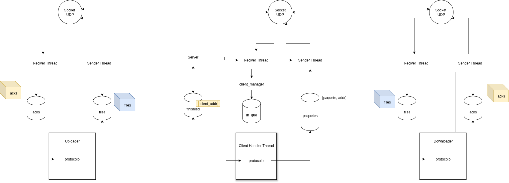

# TP 1 - REDES
```
Grupo 5 | Catedra Hamelin | Jueves | 2C2025
```

## Integrantes
- Santiago Jorda (102924)
- Joaquin Embon (111292)
- Alan Taylor (110034)
- Benjamin Castellano Bodgan (111519)
- Morena Sandroni (110205)

---

## Introducción

#### Implementación y Análisis de Protocolos de Comunicación
En este trabajo, se desarrolló un sistema multi-cliente/servidor para la transferencia de archivos de manera concurrente usando el protocolo *UDP*. El servidor fue diseñado para funcionar con dos algoritmos de control de transmisión : *Stop-and-Wait* y *Selective Repeat*.

#### Características de Tolerancia a Fallos
- **Pérdida de paquetes**: El sistema puede manejar paquetes perdidos mediante los protocolos implementados (Stop & Wait y Selective Repeat)
- **Retransmisiones automáticas**: Mecanismo de reenvío ante pérdida de paquetes
- **Timeouts configurables**: Ajuste fino de tiempos de espera según las condiciones de red



---

## Instalacion
En una terminal en directorio raiz donde esta el proyecto seguir las siguientes instrucciones

1. Creá el Entorno Virtual 📦
```bash
python3 -m venv env
```

2. Activá el Entorno: ⚡
```bash
source env/bin/activate
```

3. Instalación de Dependencias 🛠️
```bash
pip install -r requirements.txt
```

4. Formateo de codigo 📝
```bash
black .
```


## Aplicacion

### Servidor
```bash
python3 ./src/start-server.py 
```

### Cliente 
```bash
nc -u localhost <PORT>
```

##### Terminar ejecucion
Para cerrar conexion enviar la palabra `FIN`

##### Ejemplo de ejecucion: 
```bash
nc -u localhost 9000
```

--- 

### Cerrar Socket
1. Buscar sockets abiertos, reemplazar `<PORT>` por el puerto utilizado, por default es el `9000`
```bash
 sudo lsof -i UDP:<PORT>
```

2. Ver el PID del proceso y hacer un kill
```bash
sudo kill -9 <PID>
```

--- 

## Mininet

### Instalación

Mininet está diseñado para funcionar en sistemas Linux. Para instalarlo en Ubuntu o Debian:

```bash
# Instalar Mininet y sus dependencias
sudo apt-get update
sudo apt-get install -y mininet

# Instalar Open vSwitch
sudo apt install openvswitch-switch
sudo apt install openvswitch-testcontroller

# Verificar la instalación
sudo mn --test pingall
```

**Nota importante**: Mininet requiere un sistema Linux para funcionar correctamente. No es compatible con macOS o Windows de forma nativa.

### Configuración básica
El repositorio incluye un archivo `mininet_topo.py` con una configuración de topología básica que consiste en:

* Dos hosts: h1 (cliente) y h2 (servidor)
* Un switch que conecta ambos hosts
* Un enlace con 10% de pérdida de paquetes entre h1 y el switch
* Un enlace regular entre h2 y el switch

Esta topología es ideal para probar el protocolo Selective Repeat, ya que simula una conexión con pérdida de paquetes entre el cliente y el servidor.

### Ejecución

#### Preparación del entorno

Si ejecutaste previamente Mininet y tienes problemas, limpia el entorno:
```bash
sudo pkill -f ovs-testcontroller
sudo mn -c
```

#### Paso a paso detallado

1. **Iniciar Mininet con el script de topología**
```bash
mkdir -p logs; sudo python3 mininet_topo.py --source-dir /home/tu-usuario/ruta/a/TP1-Redes-Grupo5
```
Donde `--source-dir` es la ruta al directorio del proyecto en tu sistema. Si no se especifica, se usa por defecto `/home/mosandroni/mac_desktop/Facultad/TP1-Redes-Grupo5`.

Esto te dejará en el prompt de Mininet:
```
mininet>
```

2. **Levantar el servidor en h2 y enviar logs a un archivo**
```
mininet> h2 python3 src/start-server.py -v -H 10.0.0.2 -p 9000 -s ./storage > logs/server.log 2>&1 &
```
Con esta configuración, el servidor corre en background y todo su output se redirige al archivo `server.log`.

3. **Verificar que el servidor está corriendo**
```
mininet> h2 ps -aux | grep python
```
Deberías ver un proceso `python3 src/start-server.py ...`

También puedes revisar el log directamente:
```
mininet> h2 tail -n 10 /logs/server.log
```
4. **Ejecutar el cliente (upload) en h1**

De vuelta en la terminal principal de Mininet:
```
mininet> h1 python3 src/upload.py -v -H 10.0.0.2 -p 9000 -s . -n enunciado.pdf -r selective-repeat > logs/upload.log 2>&1 &
```

### Comandos útiles

#### Comandos de diagnóstico
* `h1 ifconfig` - Muestra la configuración de red del host h1, incluyendo direcciones IP, máscaras de red e interfaces disponibles.
* `pingall` - Realiza un ping entre todos los hosts de la red para verificar la conectividad básica.
* `h1 ping h2` - Comprueba la conectividad específica entre el host h1 y h2.
* `net` - Muestra la topología completa de la red con todos sus enlaces.

#### Modificación de parámetros de red
* `link h1 s1 loss 20` - Cambia la tasa de pérdida de paquetes al 20% en el enlace entre h1 y el switch s1.
* `link h1 s1 delay 100ms` - Añade un retardo de 100ms en el enlace entre h1 y el switch s1.
* `link h1 s1 bw 1` - Limita el ancho de banda a 1 Mbps en el enlace entre h1 y el switch s1.

#### Herramientas de análisis
* `xterm h1` - Abre una terminal gráfica en el host h1 para ejecutar comandos adicionales.
* `h1 tcpdump -i h1-eth0 -w captura.pcap &` - Captura el tráfico de red en la interfaz h1-eth0 y lo guarda en el archivo captura.pcap para análisis posterior.
* `h1 iperf -s &` y `h2 iperf -c 10.0.0.1` - Mide el rendimiento de la red entre h1 (servidor) y h2 (cliente).
